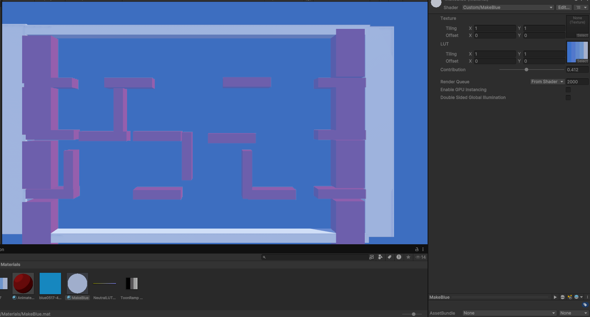

# CGMidtermRuiddgerKe
# I created an empty Unity Project and Git Repo before the class to maximize time used during the exam.
# Nothing has been added to the empty project and repo that would be outside material.  
# Part2
# Referenced lecture 5
# what i would do if i was able to make it work is that. I will have a lerp value between 0 and 1 and it returns it randomly perframe. The shadercode will then take that number and translate the toonshading texture according to that number in order to create a sense of animation. Unforetuneately, i am unable to create this shader as I am not sure how to implement it specifically but that would be the logic behind how the animated toonshader would work. 

# Part 3
# Referenced lecture 5 for both shaderscript and camera script
# blue color grabbed from https://www.color-hex.com/color-palette/88877
#  this is the image of the shader working of creating a blue atmosphere to make the Ice Climber game feel more winter-y. 
# the main idea behind it is by using the color correcting shader that was taught in class and setting it to be the blue color scale i have gotten from the internet. It creates a color correction on the screen to make it appear as if the game had sow fall or something. By sending the correction down it makes it feel more like a bad snowstorm instead of completely taking over the scene as blue due to the low amount of colors in the blue scale image i have grabbed. 

# this shader will probably be used when the player is closer to the top of the mountain where the weather is typically at its worst compared to the forest-y start of the game. 

# Part 4
# referenced lab4 rock image from https://ca.pinterest.com/pin/584482857867708993/
# if i had time i would add a transparent shader to create a rock that hides most of the mesh aside from the iamge. then i would add a bump and rim lighting componenet on it to make it both feel 3d and to have the rim light act as pieces of snow ontop of the initial shader. unforetunately i am out of time to tinker with that idea. 